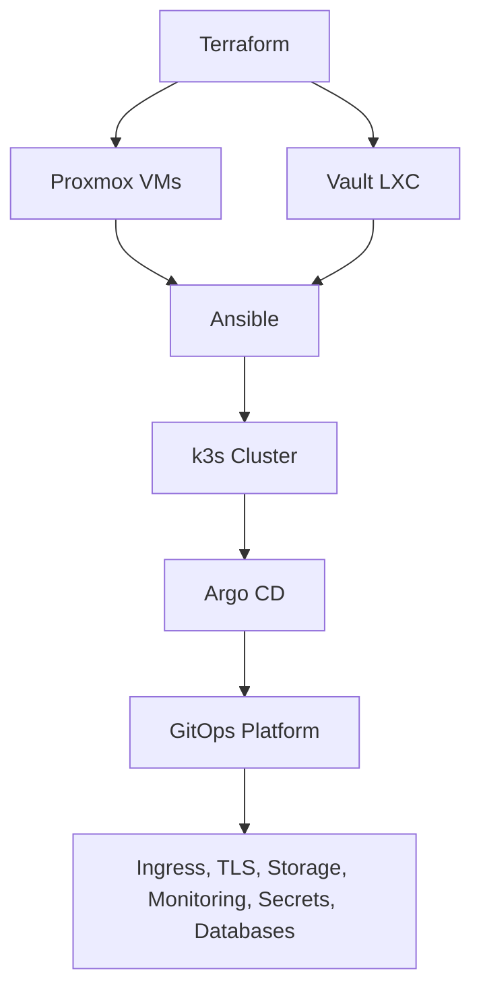

# Proxmox IaC K3s Lab

Infrastructure as Code lab project for provisioning and bootstrapping a small k3s Kubernetes cluster on Proxmox.

The goal of this project is to simulate a production-like infrastructure workflow in a home lab environment, using Terraform, Ansible, Kubernetes, GitOps, Vault, and supporting platform components.

This is a practical lab environment, not a production-ready platform.

## Stack

```text
Proxmox
Terraform
Ansible
k3s
Argo CD
Vault
External Secrets Operator
MetalLB
Traefik
cert-manager
Longhorn
CloudNativePG
kube-prometheus-stack
Grafana
Renovate
```

## Repository Layout

```text
proxmox-iac-k3s-lab/
├── terraform/        # Proxmox infrastructure
├── ansible/          # Server and cluster bootstrap
├── _kubernetes/      # GitOps layer managed by Argo CD
├── renovate.json     # Renovate configuration
└── README.md
```

## How It Works



## Deployment Flow

### 1. Provision infrastructure

Terraform is split into separate states:

```text
terraform/vms        # k3s virtual machines
terraform/vault-lxc  # Vault LXC container
```

Provision the k3s virtual machines:

```sh
cd terraform/vms
terraform init
terraform plan
terraform apply
```

Provision the Vault LXC:

```sh
cd ../vault-lxc
terraform init
terraform plan
terraform apply
```

### 2. Bootstrap the cluster

Ansible is used to configure the servers and install k3s.

```sh
cd ../../ansible
ansible-playbook playbooks/common.yaml
ansible-playbook playbooks/k3s_controller.yaml
ansible-playbook playbooks/k3s_worker.yaml
```

### 3. Install bootstrap platform components

Ansible is also used to install the initial platform components required before GitOps can fully manage the cluster.

```sh
ansible-playbook playbooks/traefik.yaml
ansible-playbook playbooks/argocd.yaml
ansible-playbook playbooks/vault.yaml
```

Additional bootstrap playbooks are available for rebuild scenarios:

```sh
ansible-playbook playbooks/cert_manager.yaml
ansible-playbook playbooks/metallb.yaml
```

After Argo CD takes over, ongoing Kubernetes platform changes should be made through the `_kubernetes` directory.

### 4. Enable GitOps management

After Argo CD is installed, apply the root application:

```sh
kubectl apply -f _kubernetes/bootstrap/root-app.yaml
```

From this point, Argo CD tracks and reconciles the Kubernetes platform configuration from Git.

## GitOps Platform

The `_kubernetes` directory manages the Kubernetes platform through Argo CD.

Current platform components include:

```text
Argo CD
MetalLB
cert-manager
External Secrets Operator
Longhorn
CloudNativePG
kube-prometheus-stack
Grafana
Homarr
pgAdmin
Renovate
```

Secrets are stored in Vault and synced into Kubernetes with External Secrets Operator.

Renovate runs inside the cluster as a CronJob and opens pull requests for Helm chart updates.

## Documentation

Project-specific documentation is available for each layer:

1. [Terraform Layer](terraform/_docs/README.md)
   Project-specific notes for the Terraform infrastructure layer.

2. [Ansible Layer](ansible/_docs/README.md)
   Project-specific notes for the Ansible bootstrap layer.

3. [Kubernetes / GitOps Layer](./_kubernetes/_docs/README.md)
   Project-specific notes for the Kubernetes and GitOps layer.

## Project Scope

This project focuses on building a small production-like Kubernetes lab on top of Proxmox.

The repository covers the full infrastructure flow: provisioning virtual machines, bootstrapping a k3s cluster, installing core platform components, managing Kubernetes resources with GitOps, handling secrets with Vault, and testing a controlled dependency update workflow with Renovate.

The exact platform components may change over time as the lab evolves.

## Contributions

This is a personal lab project.

Pull requests from external contributors are not expected to be reviewed or merged.

The repository is public for learning, documentation, and portfolio purposes.
